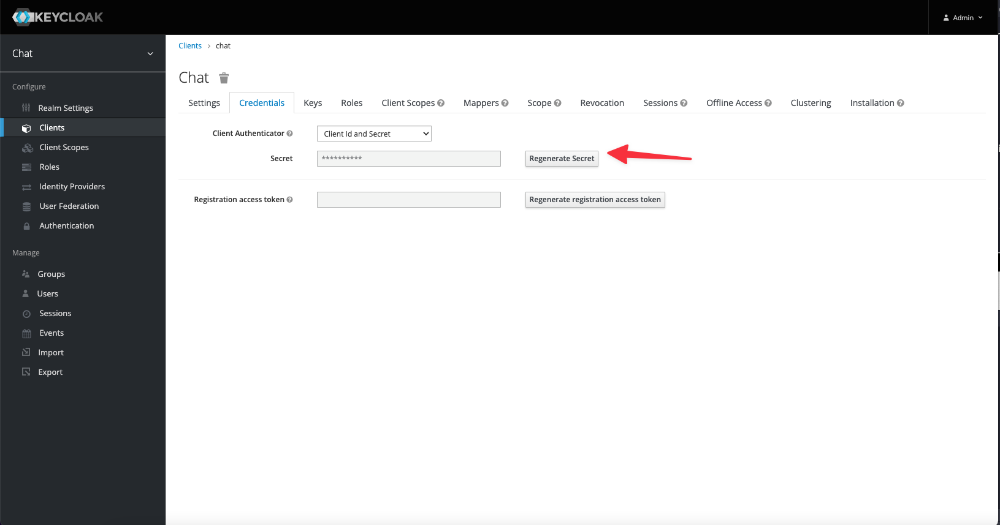
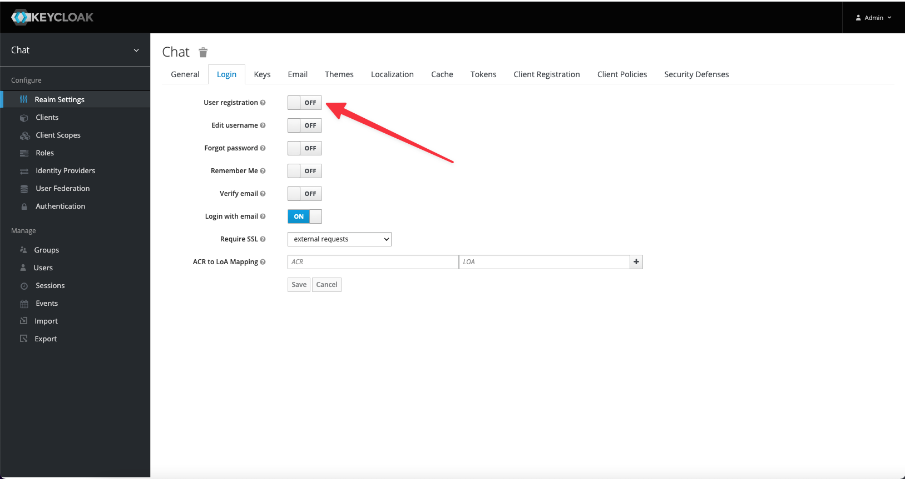
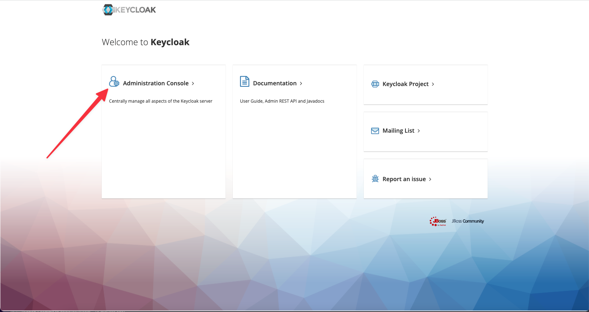
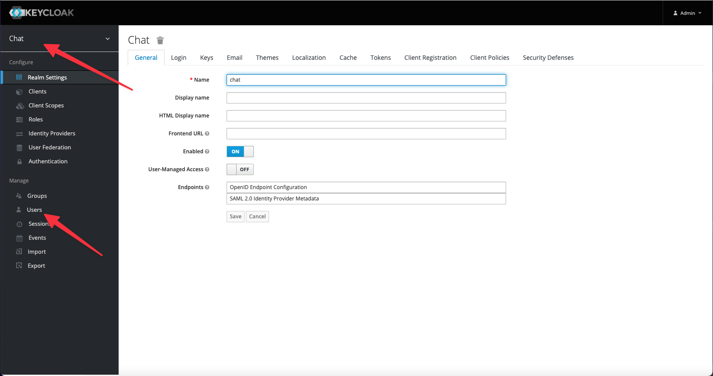
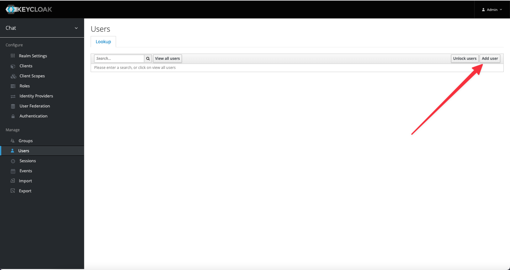
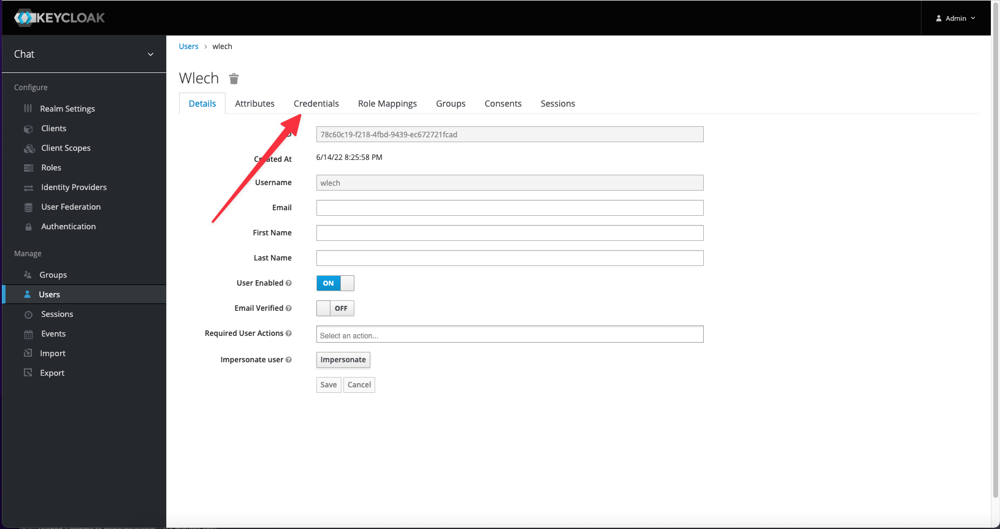
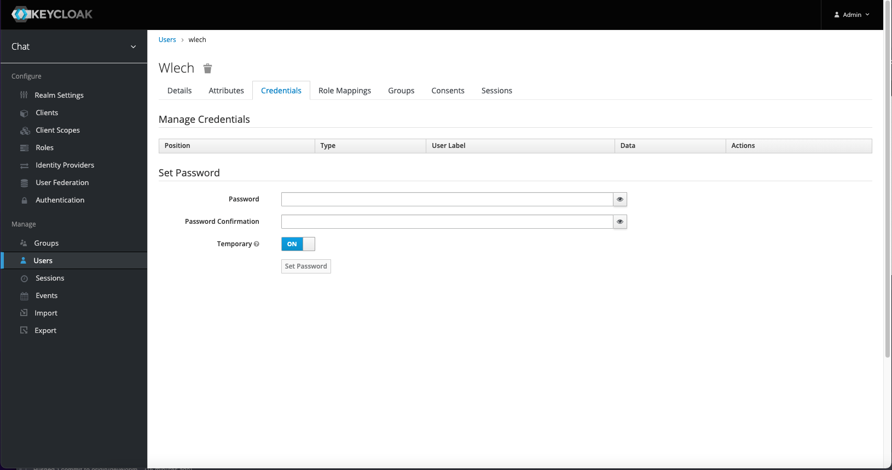
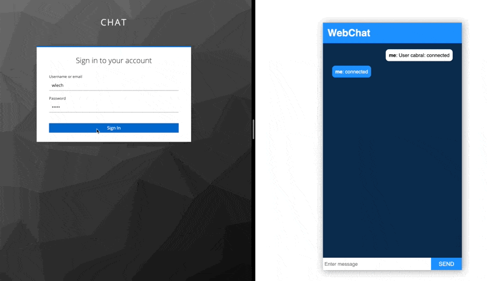
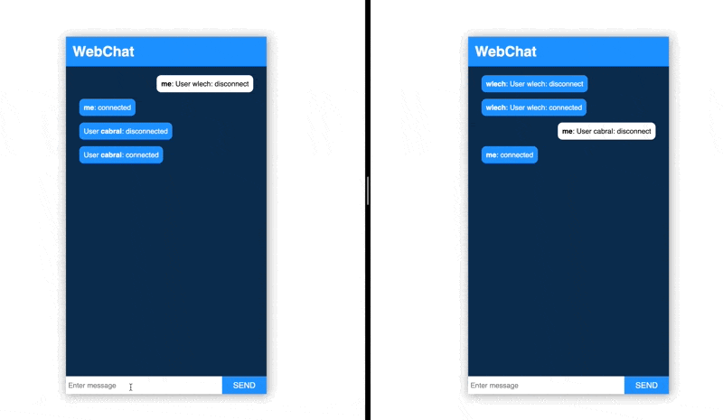

# Simple Go Chat


This is a very simple go chat using WebSockets and rabbitmq for getting stock data.

This code is not ready for production. Do not deploy in production. 

## Install

Install the project using Makefile
It will run a docker-compose up command. For installing keycloak, rabbitmq and database

```bash
  make start_dump
```

You need to wait Keycloak create the client. This might take 1 minute or 2 minutes

After that you can run

```bash
  go run src/main.go
```

If you get this error:

`Get "http://localhost:8081/auth/realms/chat/.well-known/openid-configuration": dial tcp 127.0.0.1:8081: connect: connection refused
`

It is because Keycloak is still creating the client. Go grab a coffee :)


## Setup

### Credential Key

You might need to update the credential key go to `Clients->chat->Credentials->Regenerate Secret`
After that copy the new secret and substitute the key `KEYCLOAK.CLIENTSECRET` in the file `.env.local`

```
KEYCLOAK.CLIENTSECRET=NEW KEY
```





### User registration

You will need to create some users for testing you do this 2 ways.

#### Activating the self registration in Realm `Settings->Login->User Registration`





#### Create direct in Keycloak:

Go to the admin link for Keycloak



In the login page in a dev environment the credentials are:

```
login: admin
password: admin
```

After log in make sure to be in the Realm `chat`. After that do to users



After that go to add user . You just need to set the `username`
and the password



Now you need to add a temp password fot the user



After setting the password the user can access the chat

## Keycloak

For more information about [keycloak](https://www.keycloak.org/)

## Login

Go to the link `http://localhost:8081` and add the user info

## Have Fun





